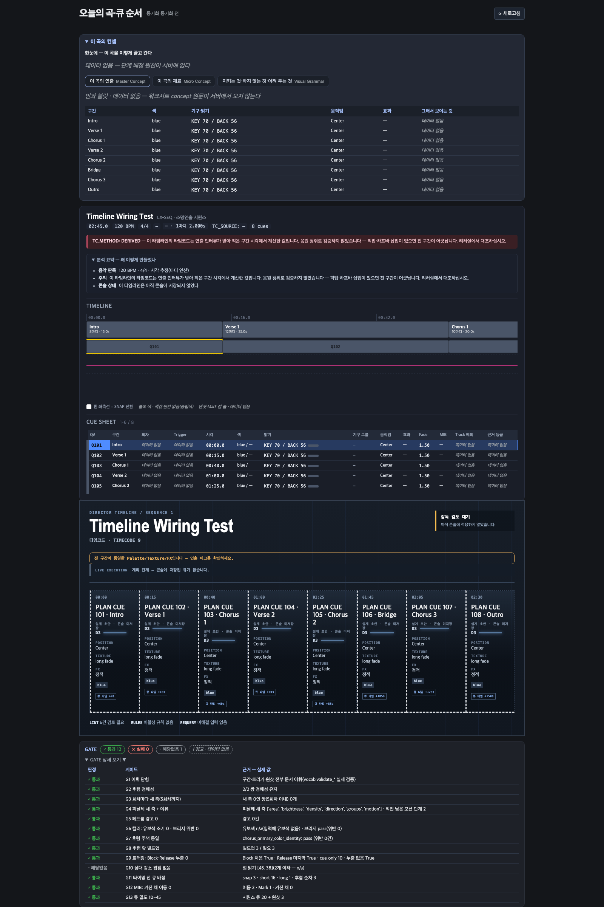

# t454 — SPEC-LDDESIGN-001 M7 2차 판정 (lane-1)

> **기록 정정(리드 지시):** 닫힌 카드 t442 사유의 「반영은 t454」는 리드 오기다. 흰색 반영 카드는 **t453**이다. t454는 런북 화면 2차다.

- 브랜치 `WT-runbook-ui-second` · 기준 `origin/main@dacba149` (착수 시 `git rev-list --count --left-right origin/main...HEAD` → `0 0`)
- 범위: 리드 승인 **A안** — 화면만 바꾸고 서버는 0줄. 원천이 있는 칸만 채우고, 없는 칸은 「데이터 없음」으로 둔다(지어내지 않음). B안(행 단위 concept_report + 20행↔8구간 짝 규칙)은 카드 **t455**, 구간별 색 HEX 내보내기는 카드 **t456**으로 분리됐다.
- 작성: 2026-09-23

## 1. 먼저 잰 것 — 서버가 실제로 내보내는 필드

`.moai/reports/t454/measure_payload.py`가 `_song_timeline_payload`를 직접 호출한다(8구간, 120 BPM, 콘솔 접촉 0). 출력은 `measure_payload.out.txt`, 페이로드 전체는 `payload.json`에 있다.

| 무엇 | 관측 |
|---|---|
| `concept_report` 키 | `available` · `gates` · `mib` · `lint_finding_count` · `lint_disabled_rule_count` · `energy_report_count` (6개) |
| `gates` | 13개. 각 게이트에 `passed`(true/false/null)와 `detail`이 있다. 이 곡은 통과 12 · 해당없음 1(G10) |
| `mib` 길이 | **20** — 화면 구간은 **8**. 컨셉 파이프라인 행(안전 큐 + 프레이즈 큐) 순서를 따르고, 행에 q·구간·시각이 없다 → 화면 행과 짝지을 수 없다 |
| 구간 행 키 | 26개(`cue_number`·`label`·`start_ms`·`palette(_primary)`·`intensity`·`d_level`·`movement`·`fade_seconds`·`trans`·`mib`(bool)·`*_source` 4개 등) |
| UI의 `concept_report` 사용 | `ui/src`에서 grep 결과 0건(착수 시) |
| `palette_legend` | 서버가 채우지 않는다(`session.py` `_song_cue_sheet_view_fields` 독스트링) → 블록 색은 항상 중립색 `#4A5568` |

## 2. 원천 매핑 표 (화면 칸 → 원천 필드)

| REQ | 화면 칸 | 원천 | 처리 |
|---|---|---|---|
| 084 | GATE 통과/실패/해당없음 개수 | `concept_report.gates[*].passed` | ✅ 채움 |
| 084 | GATE 경고(WARN) | 없음(`passed`는 세 값뿐) | 「데이터 없음」 배지 |
| 084 | 상세 표 판정/게이트/근거 | `gates` 키 + `detail` | ✅ 그대로 |
| 084 | `available:false` | `reason` | 사유 문장을 그대로 표시 |
| 082 | Q# | `cue_number` | ✅ |
| 082 | 구간 | `label` | ✅ |
| 082 | 회차 | 없음 | 「데이터 없음」 |
| 082 | Trigger | 없음 | 「데이터 없음」 |
| 082 | 시각 | `start_ms` | ✅ |
| 082 | 색 | `palette_primary`/`palette_secondary`(없으면 `palette`) | ✅ |
| 082 | 밝기 + 막대 + ▲▼ | `intensity`(없으면 `d_level`×20), 직전 행과 비교 | ✅ |
| 082 | 기구 그룹 | `fixture_groups` | ✅(없으면 `—`) |
| 082 | 움직임 | `movement` | ✅ |
| 082 | 효과 | `effect`(없으면 `fx`) | ✅ |
| 082 | Fade | `fade_seconds` | ✅ SNAP 강조는 Fade 칸으로 옮김 |
| 082 | MIB | `mib: boolean`뿐 | 「사전이동 있음 / —」. 기호 3종(◐◇◑)은 쓰지 않음 |
| 082 | Track 예외 | 없음 | 「데이터 없음」 |
| 082 | 근거 등급 | 없음(`*_source`는 4등급 어휘가 아님 — 옮겨 적으면 지어낸 것) | 「데이터 없음」 |
| 082 | 색 레일(7px) | `paletteColorFor` — 범례가 없으면 중립색 | 부분(t456 뒤에 실색) |
| 082/096 | TC Out·Dur·Mood·Trans·Note | — | 화면에서만 제거. `trans` 타입·서버 경로는 그대로 |
| 081 | 블록 색 | `palette_legend`만 — 서버 미공급 | 중립색 + 범례에 「색값 원천 없음」(t456) |
| 081 | 원샷·Mark 점 줄 | 없음(`mib` mark는 짝지을 수 없음) | 그리지 않음 + 범례에 「데이터 없음」(t455) |
| 079 | 패널(기본 접힘·헤더 `이 곡의 컨셉`) | — | ✅ |
| 097 | 한눈에 5단계 카드 | 없음 | 「데이터 없음」. 단계 이름도 쓰지 않음 |
| 098 | 탭 3개 고정 라벨 + 영어 보조 | — | ✅ |
| 080 | 인과 불릿(워크시트 `concept` 원문) | 없음(`profile.concept`은 시드 이름) | 「데이터 없음」 |
| 080 | 6칸 표 구간/색/기구·밝기/움직임/효과 | 구간 값 | ✅ |
| 080 | 「그래서 보이는 것」 | 없음 | 행마다 「데이터 없음」 |
| 079 | 항목 클릭 4칸 설명 | 펼칠 항목(불릿·칩)이 없음 | 그리지 않음 |
| 080 | 탭 2·3 본문 | 없음 | 「데이터 없음」 |

## 3. 변경

- `ui/src/protocol.ts` — `SongTimelineConceptReport` 타입과 `concept_report?` 필드 추가(서버 모양 그대로)
- `ui/src/components/runbookM7.ts` (신규) — 순수 함수: `gateTally`·`gateRows`·`intensityTrend`·`mibCellText`·`grammarRows`, `NO_DATA`
- `ui/src/components/RunbookGateBar.tsx` (신규) — 런북 전용 상태줄 GATE. 앱 셸 `StatusBanner`는 건드리지 않았다
- `ui/src/components/ConceptPanel.tsx` (신규) — 컨셉 패널
- `ui/src/components/CueSheetTimeline.tsx` — 14열, 색 레일, 구간 구분선, 밝기 막대와 ▲▼, 원천 없는 칸, 범례 고지
- `ui/src/components/RunbookMode.tsx` — 패널을 블록 1과 타임라인 사이에, GATE를 맨 뒤에 배치
- `ui/src/styles.css` — 런북 전용 선택자만 추가(메인 화면 선택자는 그대로)
- `ui/runbook-preview.html` · `ui/src/runbookPreview.tsx` · `ui/src/components/runbookServerPayload.json` — 백엔드 없이 여는 미리보기. 데이터는 `payload.json` 사본(서버 실출력)
- `ui/src/components/runbookM7.test.tsx` (신규) — 19건

서버(`server/`) 변경 0줄.

## 4. 증거

| 주장 | 명령 | 관측 |
|---|---|---|
| RED | `npx vitest run src/components/runbookM7.test.tsx` (구현 전) | `Failed to load url ./ConceptPanel` — Test Files 1 failed |
| GREEN | `npx vitest run` (ui 전체) | `Test Files 26 passed (26)` · `Tests 602 passed (602)` (기존 583 + 신규 19) |
| 타입 | `npx tsc --noEmit` | exit 0 |
| 빌드 | `npx vite build --outDir <tmp>` | `✓ built in 307ms` |
| 가드 판별력 1 | `mibCellText`가 `"◐ dark"`를 내도록 바꾸고 재실행 → 원복 | `1 failed \| 18 passed` → 원복 후 602 passed |
| 가드 판별력 2 | 「데이터 없음」 칸 하나를 `note` 칸으로 바꾸고 재실행 → 원복 | `1 failed \| 18 passed` → 원복 후 602 passed |
| 화면 | vite dev(:5391) + 헤드리스 Chrome 1600×2400, `runbook-preview.html?open=1` | `runbook-open.png` (아래) |

## 5. 안 잰 것 (Gaps)

- **실제 곡으로는 안 봤다.** 화면 캡처에 쓴 데이터는 시험 픽스처로 만든 계획(8구간, 전부 `blue`·D3)을 서버 함수에 통과시킨 결과다. 실제 감독 곡이나 콘솔 연결 상태의 앱은 열어 보지 않았다.
- **앱 본체(`index.html` + WebSocket)에서는 확인하지 않았다.** 미리보기 페이지로만 봤다.
- **캡처는 한 장, 패널을 펼친 상태만 찍었다.** 기본(접힘) 상태와 탭 2·3 전환은 캡처하지 않았다. 탭 전환은 `useState`로 하는데, DOM 테스트 하네스가 없어서 클릭 동작은 시험하지 않았다(정적 렌더만 검사).
- **색 레일·블록 색의 실색은 보이지 않는다.** 범례 원천이 없어서 전부 중립색이다(t456 대상).
- **MIB `true` 행은 캡처에 없다.** 이 픽스처에서는 8구간 모두 `mib: false`다. 「사전이동 있음」 표기는 단위 시험으로만 확인했다.
- 전체 Python 시험은 돌리지 않았다(서버 변경 0줄). CI에 맡긴다.

## 6. 남은 위험

- 「데이터 없음」 칸이 4열 × 행 수만큼 나와서 표가 시끄럽다. t455가 들어오면 사라질 칸이다.
- `.cst-sheet tr.is-selected td` 규칙을 런북 전용 블록에서 덮어썼다. 같은 컴포넌트를 쓰는 `cuesheet-preview.html`의 선택 행 모양도 바뀐다(노랑 → 파랑). 메인 화면은 이 컴포넌트를 쓰지 않는다(`<CueSheetTimeline`은 `RunbookMode`와 미리보기 두 곳에서만 쓴다 — grep).
