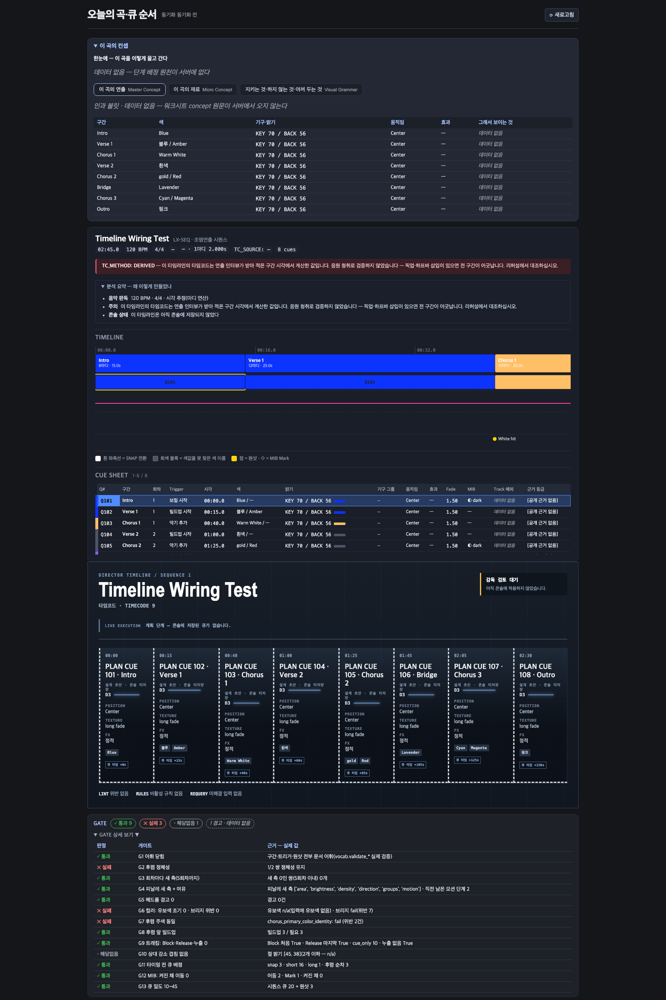

# t458 판정서 — 런북 화면이 #503 새 데이터를 쓰게 (SPEC-LDDESIGN-001 M7 3차)

- 카드: t458 (클래스 C)
- 브랜치: `WT-runbook-ui-third` · 기준 `origin/main` `ab1c12f9` (#503 머지 뒤)
- 범위: UI만 고쳤다. 서버 변경은 0줄이고, 메인 화면 컴포넌트는 건드리지 않았다(`CueSheetTimeline`은 런북과 미리보기에서만 쓴다 — t454 판정서 §6). 콘솔 쓰기 0건.

## 1. 채운 칸과 원천

| 화면 칸 | 원천 | 짝짓기 안 될 때(`row_pairing.available=false`·리포트 없음) |
|---|---|---|
| CUE SHEET 회차 | `rows[]`에서 그 화면 구간의 section 행 `occurrence` | 데이터 없음(t454 그대로) |
| CUE SHEET Trigger | 그 구간 행들의 `trigger`(나온 순서, 중복 제거, `·`로 연결). 없으면 「—」 | 데이터 없음 |
| CUE SHEET MIB | 그 구간 행들의 `mib` → `◐ dark` / `◇ mark` / `◑ live`. 없으면 「—」 | t454의 bool 표기(「사전이동 있음」/「—」) |
| CUE SHEET 근거 등급 | section 행 `evidence`. null이면 `[공개 근거 없음]`(REQ-072, 리드 추가 지시), 값이 있으면 등급 이름 | 데이터 없음 |
| 원샷·Mark 점 줄 | `one_shot`이 있는 행과 `mib="mark"`인 행을 `ts`(초) 위치에 표시 | 점을 그리지 않음 + 범례 「원샷·Mark 점 줄 · 데이터 없음」 |
| 타임라인 블록·시트 색 레일 | `palette_primary_hex`(t456) → 없으면 범례 → 없으면 중립색 `#4A5568` | 해당 없음(색은 짝짓기와 무관) |
| Track 예외 | 이 카드 범위 밖 | 데이터 없음 그대로 |

- 짝짓기는 서버 `screen_position` 하나로만 한다. 구간 이름은 행의 `section`이 아니라 화면 구간의 `label`을 쓴다. 점 줄 설명에도 `Chorus 3`이 나오고 `Final Chorus`는 나오지 않는다(시험으로 고정).
- 범례: HEX가 하나라도 있으면 「회색 블록 = 색값을 못 찾은 색 이름」을 보인다. 색값 원천이 전혀 없을 때만 t454의 「색값 원천 없음(중립색)」이 나온다.

## 2. 변경 파일

- `ui/src/protocol.ts` — `palette_primary_hex`·`palette_secondary_hex`·`rows`·`row_pairing` 타입, `SongTimelineConceptRow`
- `ui/src/components/runbookM7.ts` — 순수 함수 `conceptBySection`·`conceptCells`·`timelineDots`·`sectionHex`, 상수 `NO_PUBLIC_EVIDENCE`
- `ui/src/components/CueSheetTimeline.tsx` — 칸 연결, 점 줄, 범례, `paletteColorFor`가 `sectionHex`를 거치도록 변경
- `ui/src/styles.css` — `.cst-dots`·`.cst-dot`·`.cst-legend-dot`(파일 끝에 런북 전용 선택자로 추가)
- `ui/src/components/runbookServerPayload.json` — 서버 실출력으로 교체(`.moai/reports/t458/measure_payload.py`. 구간마다 색을 달리 준 8구간 곡)
- `ui/src/components/runbookM7Third.test.tsx` — 신규 16건
- `ui/src/components/runbookM7.test.tsx` — t454의 시험 2건을 새 원천에 맞게 고침(아래 §4)

## 3. 증거

| 주장 | 명령 | 관측 |
|---|---|---|
| 서버 실출력 | `.venv/bin/python .moai/reports/t458/measure_payload.py` | `row_pairing {available: True}`, 20행. HEX `#0D33FF ×2 · #FFBF66 · #8C59FF · #00E6FF`, null 3개(흰색·gold·핑크) (`measure_payload.out.txt`) |
| RED | `vitest run src/components/runbookM7Third.test.tsx` (컴포넌트 연결 전) | `4 failed \| 12 passed` — 순수 함수는 통과, 화면 4건 실패 (`vitest_red.txt`) |
| GREEN | 같은 명령 | `16 passed` (`vitest_green.txt`) |
| UI 전체 | `vitest run` | `Test Files 27 passed` · `Tests 618 passed` (`vitest_all.txt`) |
| 타입 | `tsc --noEmit -p ui` | exit 0 (`tsc.txt`) |
| 빌드 | `vite build` | `✓ built in 347ms` (`vite_build.txt`) |
| 변이 | `conceptBySection`에서 `row_pairing` 검사를 지우고 재실행 → 원복 | `3 failed \| 13 passed` → 원복 후 618 passed |
| 화면 | vite dev(:5397) + Playwright headless shell 1600×2400, `runbook-preview.html?open=1` | `runbook-third.png` |

## 4. 기존 시험 2건을 고친 이유

t454 시험 두 건이 「원천이 없다」는 당시 사실을 고정하고 있었다.

- 「MIB는 bool 원천뿐이라 기호 3종을 쓰지 않는다」 → 「짝짓기가 없으면 MIB는 bool 표기다」로 바꿨다. bool 표기 단언은 그대로 두고, 소스에 기호가 없다는 단언만 뺐다(기호는 이제 원천이 있다).
- 「원천 없는 4열 = `className="nodata"` 4개」 → 늘 원천이 없는 칸은 Track 예외 1개, 짝짓기에 따라 갈리는 칸(`conceptClass`)은 3개로 바꿨다. 짝짓기 실패 때 행마다 4칸이 데이터 없음으로 돌아가는 것은 `runbookM7Third.test.tsx`가 렌더 결과로 확인한다.

## 5. 안 잰 것 (Gaps)

- **미리보기 페이지로만 봤다.** 앱 본체(`index.html` + WebSocket)에서는 확인하지 않았다. 실제 감독 곡으로도 보지 않았다.
- **캡처에는 점 줄의 첫 화면(0~40초)만 보인다.** 타임라인이 가로 스크롤이라 White hit 하나만 찍혔다. 나머지 원샷 2개와 Mark는 렌더 시험으로만 확인했다.
- **MIB `live`는 실출력에 한 번도 없었다.** 기호 표기는 표에만 있고, 실제로 그려진 것은 보지 않았다.
- **근거 등급 값이 있는 경우**(t457)는 단위 시험으로만 확인했다(`verified` 한 건). 서버 실출력에는 아직 전 행 null이다.
- 가로 스크롤과 세로 스크롤 연동(REQ-085)은 점 줄에 대해 따로 확인하지 않았다. 점 줄은 블록과 같은 스크롤 컨테이너 안에 있다.

## 6. 잔여 위험

- 점 위치는 서버 `ts`(초 단위로 버림)를 쓴다. 구간 블록은 ms 단위라 점이 최대 1초 왼쪽으로 어긋날 수 있다.
- 미리보기 GATE는 통과 9 · 실패 3(G2·G6·G7)으로 보인다. 미리보기 곡에 구간마다 일부러 다른 색을 넣었고, 서버가 그 입력 색으로 판정한 결과다. 결함이 아니다.
- 원샷 점과 Mark 점이 같은 시각에 겹치면(이 곡의 q15, 125초) 두 줄 높이를 달리해 구분한다(`.cst-dot.is-mark top: 13px`). 좁은 화면에서는 글자가 겹칠 수 있다.
