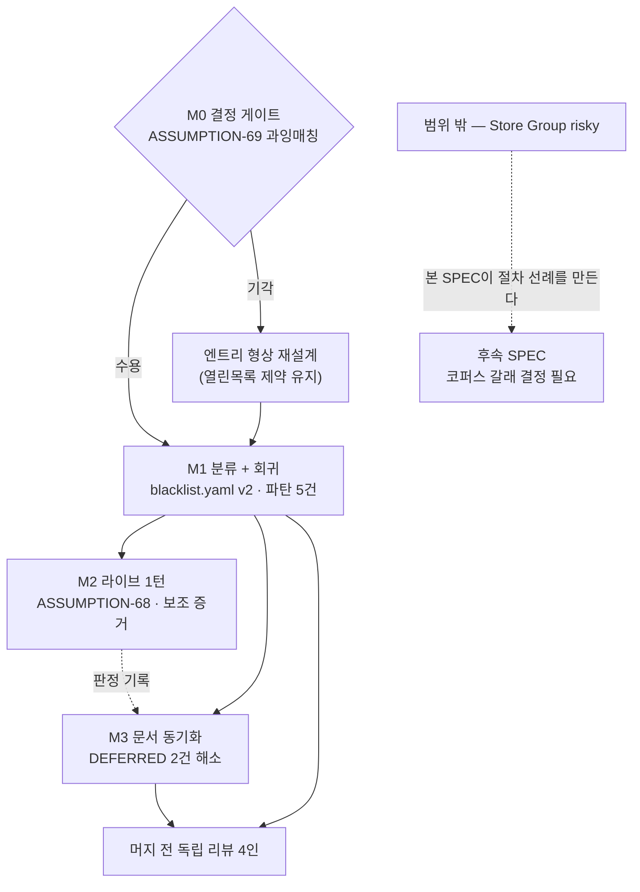

# 구현 계획 — 쓰기 경로 무결성

base `origin/main` = `b1a630e` · branch `spec/writepath-001` · worktree `~/orca/workspaces/AI-Lighting_Console/writepath`

## A. 확정된 결정 (사람 승인 · 2026-08-05)

두 건은 **착수 전에 사용자가 결정했다.** 에이전트가 조용히 고른 것이 아니며, 재논의 대상이 아니다.

| 결정 | 선택 | 근거 |
|---|---|---|
| **코퍼스 갈래** | **③ 범위 분리** — 좌표(패치 쓰기)만 본 SPEC, `Store Group`은 별도 게이트 | 실측: `corpus.yaml`에 `Set` 토큰 **0개**. 좌표 축은 코퍼스 충돌 0건이고, 충돌은 오직 `Store` 축에만 있다 — 패치의 `_would_be_held` 술어를 `load_corpus()`에 직접 돌린 재실측으로 엔트리 `Store`가 **21 시나리오 중 10건 · 10 대표 태스크 유형 중 5종**(`cue-store-1/2`·`group-create-1/2/3`·`macro-create-1/2`·`page-setup-1`·`preset-store-1/2`), 실제로 거명된 리터럴 `Store Group`은 **3/21 · 1/10**(`group-create-1/2/3`)이다. 이전 문면의 *"13/21 · 7/10"*은 `Store\|Set\|Assign\|Copy` 광역 정규식이 센 **커맨드 13건**(13 시나리오 / 6 유형)을 `Store`의 시나리오 수로 옮겨 적은 것이다 — `Store`를 포함하는 어떤 코퍼스 동사 합집합도 13/7에 닿지 않는다(코퍼스 천장은 17/8. 21건 중 4건은 `mock.commands`가 없다). **결정은 그대로 선다**(`group_create`가 AC-MVP-001 10대표 중 1종이고, DEPLOY 픽스처 충돌은 코퍼스 규모와 무관하다) — 과대 계상된 것은 대안의 비용뿐이다. 계획서의 ①/② 이분법은 `Store Group`을 A에 넣는다는 전제에서만 성립했다 |
| **예외 목록** | **먼저 무접촉 설계를 찾고, 불가피하면 비준 AC** | 찾았고 불가피하다(§C). 무접촉 대안 2건은 검토 후 기각 — 기각 이유를 문서에 남긴다 |

## B. 설계 결정 — 왜 폐쇄집합 데이터 1행인가

### B.1 채택안

`server/safety/blacklist.yaml`을 **version 1 → 2**로 범프하고 엔트리 **`"Set Fixture"` 1건**을 추가한다. **코드는 한 줄도 바뀌지 않는다** — `classify.py`·`ruleset.py`·`gate.py`·`expand.py` 전부 무변경.

19건 전수 실측으로 확인했다(`research.md` §5, 불일치 0):

- 위험한 좌표 형태 **전부** hold — 정규형·부호소실형·무동작형·3자축약·**범위 기록**(`Set Fixture 1 Thru 18 Posz`)·방향축·동사축약
- **매크로 프로퍼티 밀반입**(`Set Macro … Property 'Command' "Set Fixture … Posx …"`)도 hold — 기존 재귀(`classify.py:201-222`)가 공짜로 잡는다
- MAtricks 프로그래머 상태 · `Set Macro … Property` 정상형 · `Store`/`Assign`/`Copy`/`Label`/`Fixture`/`Group`/`At` **전부 분류 불변**

### B.2 기각한 대안과 그 이유

| 대안 | 트립와이어 비용 | 왜 기각인가 |
|---|---|---|
| **A. `gate.py`에 탐지기 추가** — 이미 허용된 행이고 삭제 0이므로 **트립와이어 개정 0건** | **0** | `classify.py:169-172` @MX:ANCHOR가 *"a second classifier would fork the closed-set interpretation"*로 금지. 구체적 손실: 매크로 프로퍼티 재귀는 `classify_command`를 재귀 호출하므로 게이트 계층 탐지기는 **밀반입 케이스를 놓친다.** 문서화된 아키텍처 불변식을 트립와이어 1행과 바꾸는 나쁜 거래 |
| **B. 툴 계층 승인 seam** (GROUPGEN `group_approval_port` 방식) | **0** | (a) `before_risky_execution()`을 **발동시킬 수 없다** — 백업 매니저는 게이트 내부(`gate.py:362-365`)이므로 `AC-SPATIAL-031`이 명시 요구하는 절반을 못 채운다 (b) 승인 창구가 셋이 된다 (c) §A.3의 부채를 좌표 축에 복제한다 |
| **C. `classify.py`에 narrow 탐지기 + 신규 `category`** | 2행(`classify.py`+`expand.py`) | 신규 category 값은 `expand.py:110-124`·`deploy/scan.py:138-159`에서 **조용히 통과한다** — 매크로 본문·Lua 배포 경로에 FN 구멍 2개를 새로 뚫는다. 기존 값을 쓰면 두 경로가 수정 0으로 덮인다 |
| **D. 프로퍼티 이름 열거**(`Set Posx`·`Set Posy`… 6엔트리) | 1행 | `blacklist.yaml:3-4` *"open-ended lists are prohibited by spec"* 위반 — *"다음 프로퍼티는?"*이 열린다. `Set Fixture`는 닫혀 있고 완전하다 |

**채택안이 유일하게 코드 무변경**이며, 트립와이어 비용 1행이 그 값이다.

## C. 트립와이어 — 무접촉이 왜 불가능한가

`test_overlap_preserve.py`는 `_PRECHK_BASE..HEAD` **커밋 범위**의 `server/safety/` **변경 파일 집합**을 고정한다 — `TestSafetyChokepointFileSet::test_exactly_the_expected_files_changed`(현재 `:467-469`, 착수 시점 `:436-438`. 본 SPEC이 같은 파일에 그랜트 주석 블록 `:153-174`를 삽입해 +31행 밀렸으므로 **테스트 이름이 정본이고 행 번호는 보조**다). *무엇을 바꿨는가*가 아니라 *어느 파일을 건드렸는가*에 민감하다. 그리고 SPATIAL `progress.md:294-296`이 확립했듯 **`screen()`에는 호출자측 risky 선언 seam이 없다** — 따라서 어떤 설계든 `server/safety/` 아래 최소 한 파일을 건드린다. 회피 불가.

실측한 정확한 비용(커밋 후 측정 — 미커밋 상태에서는 커밋 범위를 읽으므로 관측되지 않는다):

```
FAILED test_overlap_preserve.py::TestSafetyChokepointFileSet::test_exactly_the_expected_files_changed
  Extra items in the left set: 'server/safety/blacklist.yaml'
1 failed, 30 passed
```

**1건뿐이다.** `test_the_deletion_counts_match`·`test_the_deletions_are_exactly_the_pinned_lines`는 각각 자기 딕트를 순회하므로 신규 파일을 검사하지 않는다 — 그래서 **세 겹 고정을 스스로 채워 넣는다**(REQ-WRITEGATE-010):

```python
_SAFETY_EXPECTED_DELETIONS = {
    ...,
    "server/safety/blacklist.yaml": 1,      # version: 1 → version: 2
}
_SAFETY_ALLOWED_DELETED_LINES = {
    ...,
    "server/safety/blacklist.yaml": ("version: 1",),
}
```

그랜트 주석은 **같은 파일의 기존 2건 형식을 복사한다**(`:64-77` · `:88-95`) — 날짜 · SPEC id · 무엇이 왜 허용되는가 · `user-approved` 표기 · *"그 밖의 것은 여전히 실패한다"* 문장.

## D. 마일스톤

### M0 — 결정 게이트 (라이브 프로브 아님)

측정할 것이 남지 않았다 — 분류 거동은 §B.1에서 이미 19건 전수 실측했다. M0는 **사람 결정 1건**만 처리한다.

- **[NEEDS CLARIFICATION: 과잉매칭 범위의 운영 수용성 (ASSUMPTION-69)]** — `"Set Fixture"` 엔트리는 좌표뿐 아니라 **모든 픽스처 패치 쓰기**를 잡는다. `Set Fixture 11 Name 'Spot 11'`, 패치 주소 변경 등도 승인 카드가 뜬다. 세 갈래: ① 수용(권장 — `classify.py:5-10`의 *"over-matching is resolved by human approval"* 정책과 일치, 그리고 픽스처 패치 쓰기는 전부 쇼파일 변형이다) ② 엔트리를 좁힌다(단 §B.2 D의 열린목록 제약에 걸린다) ③ 범위를 넓혀 `Set` 전체(→ `Set Macro` 매크로 저작·MAtricks가 깨진다, 기각).
- 산출: `progress.md §E`에 폐쇄 어휘 판정 행. 결정 없이 M1에 진입하지 않는다.

### M1 — 분류 + 회귀 (본체)

실측된 파탄 집합 **5건**을 순서대로 처리한다. AC-SPATIAL-031이 적은 *"기존 테스트 10건"*은 **과대 계상이었다** — 되돌린 시점의 집계이며 본 설계와 다르다.

| 순서 | 대상 | 성격 | 처리 |
|---|---|---|---|
| 1 | `blacklist.yaml` | 개정 | version 1→2 + 엔트리 1건 |
| 2 | `test_safety_ruleset.py::test_blacklist_is_exactly_the_six_initial_entries` | **의도된 마찰** — 문면이 *"any change creates review friction on purpose"* | 고정값 6→7 개정 + 개정 근거 주석 |
| 3 | `test_spatial_arrange.py::test_a_coordinate_bundle_is_not_yet_classified_risky` | **일부러 심은 트립와이어** | 삭제 아님 — **승인 흐름 단정으로 교체**(REQ-WRITEGATE-012). MAtricks 불변 고정(`:949-951`)은 **유지** |
| 4 | `test_spatial_arrange.py::TestLiveLockDemotion::test_the_unlocked_control_actually_writes` | 하네스 낡음 — 기본 `DenyAllApprovalPort`가 **올바르게** 막았다 | 승인 포트 주입. *제품이 옳고 픽스처가 낡은* 경우(SPATIAL `progress.md:337-341`가 첫 시도에서 이미 진단) |
| 5 | `test_spatial_arrange.py::TestGateChokepoint::test_the_bundle_is_screened_before_anything_is_executed` | 동일 | 승인 포트 주입 |
| 6 | `test_overlap_preserve.py` | 타 SPEC 소유 불변식 | 비준 그랜트 3겹(§C) |

신규 단정(교체·추가):

- 좌표 번들 스크리닝 → `risky=True` · 승인 카드 1건 · `before_risky_execution()` 호출 1건
- 승인 **거부** → 콘솔 송신 **0건** + 복원 번들 그대로 회신
- 매크로 본문에 담긴 패치 쓰기 → expand-or-hold가 hold (`expand.py` 수정 0으로 성립함을 단정)
- Lua 소스에 담긴 패치 쓰기 → 배포 스캔이 `blacklisted` 보고 (`deploy/scan.py` 수정 0)
- 범위 기록(`Set Fixture 1 Thru 18 Posz '5.0'`) → `risky=True`
- 분류 불변 회귀: `Store Group 3` · `Store Preset 4.1` · `Assign …` · `Copy …` · MAtricks · `Set Macro … Property`

**뮤테이션(원인에 건다, 현상에 걸지 않는다)**: `blacklist.yaml`에서 엔트리 1건을 제거하면 위 신규 단정 전건이 RED여야 한다. 리그 지문이 아니라 **분류 규칙 자체**가 변이 표적이다(계획서 §위험 5 — 미러 아티팩트를 2회 놓친 패턴의 교훈).

### M2 — 라이브 1턴 (보조 증거)

- 전제: `lsof -nP -iUDP:9005`에 **우리 앱 프로세스가 없음**(grandMA3 onPC는 `SO_REUSEADDR`로 공존 가능 — 본 세션 실측: PID 1106 `app_gma3 HOSTTYPE=onPC`).
- 하네스: `server/tools/groupgen_e2e.py` · `tools/console_probe.py`(둘 다 추적 자산 — M0 재발명 비용 0).
- 관측: 좌표 기록 지시 1건 → **카드가 뜨는가**. 거부 1회(송신 0건 확인) → 승인 1회(기록 완료 + 재조회 일치 확인).
- **ASSUMPTION-68 판정.** NEGATIVE라도 M1의 구조적 성공 기준은 이미 충족돼 있다(REQ-WRITEGATE-014) — 카드 경로 결함으로 별건 처리하고 분류는 유지한다.

### M3 — 문서 동기화 (`[DEFERRED]` 해소)

- SPATIAL `acceptance.md` `AC-SPATIAL-031` — `[DEFERRED]` 제거, 본 SPEC이 판정을 운반한다는 표기, **뮤테이션 대상 복귀**(되돌렸을 때 제외했던 것).
- SPATIAL `spec.md` `REQ-SPATIAL-020`(규칙 ③ 연동 절) · `REQ-SPATIAL-024`(승인 흐름 절) — 부분 `[DEFERRED]` 해소. REQ-024의 *"감사 의미로는 참이고 승인 의미로는 거짓"* 이라는 두 뜻 읽기가 §E.2.20을 놓친 문면상 원인이었으므로 **한 뜻으로 다시 쓴다**.
- SPATIAL `plan.md §B M4`의 risky 분류 확장 행.
- `CHANGELOG.md` · 폐쇄집합 개정 절차 기록(OVERLAP `research.md:365-367`이 *"절차를 문서화하는 것 자체가 산출물"*이라고 요구 — `blacklist.yaml` 리터럴의 **첫 개정 사례**다).

## E. 위험

| 위험 | 심각도 | 대응 |
|---|---|---|
| **측정 코퍼스 불변식 충돌** | ~~HIGH~~ → **소멸** | 실측으로 해소됨: `corpus.yaml`에 `Set` 0개, 전 스위트에서 코퍼스·측정 테스트 그린. 범위 분리 결정이 이 위험을 제거했다 |
| **예외 목록 트립와이어** | ~~MED~~ → **LOW** | 실측 1건, 같은 파일에 그랜트 선례 2건. 무접촉 대안 2건은 검토 후 기각 이유 문서화(§B.2) |
| **신규 `category`가 두 소비처에서 조용히 열림** | HIGH | 설계로 회피: 기존 category 유지(REQ-WRITEGATE-005). `expand.py`·`deploy/scan.py`에 **수정 0으로 덮인다는 것을 단정으로 고정**한다 — 회피했다는 사실 자체가 테스트로 남는다 |
| **과잉매칭이 운영을 방해** | MED | M0 결정 게이트. 라이브에서 카드 피로가 관측되면 엔트리 형상 재설계(단 열린목록 제약 유지) |
| **"모델이 준수한다"를 성공 기준으로 세울 수 없다** | HIGH | 본 SPEC은 애초에 **모델 준수를 요구하지 않는다** — 분류는 문면 기반이고 모델이 무엇을 의도했는지 묻지 않는다. 라이브는 보조 증거(REQ-WRITEGATE-014) |
| **`Store` 축이 열린 채 남는다** | MED (수용) | 사용자 결정. 손실을 §D에 명시했고, 본 SPEC이 절차 선례를 만들어 후속 비용을 낮춘다 |
| **같은 결함을 두 번 놓치는 패턴** | MED | 뮤테이션을 분류 규칙(원인)에 건다. 파탄 집합을 **추정하지 않고 실측**했다 — 문면의 "10건"이 실제 5건이었다는 것이 이 규율의 산출물 |

## F. 진행 방식

1. **머지 전 독립 리뷰 4인 병렬**(필수) — 파일 무교차 축 + *"반증을 시도하라"*. PR #24에서 P0 1건 + P1 3건을 잡았고 P0은 리뷰어 2인 독립 수렴이었다.
2. **기존 선례를 먼저 찾는다**(필수) — 본 계획의 핵심 판단 3건이 전부 선례에서 나왔다: 그랜트 블록 형식(2건 기존), 폐쇄집합 개정 규율(EXECREF 실행 선례), 툴 계층 seam이 부채라는 진단(GROUPGEN 자기 문서). `grep`이 리뷰보다 싸다.
3. **뮤테이션을 원인에 건다**(필수).
4. **검증한 쪽도 틀릴 수 있다**(필수) — 숫자를 적을 때 측정 범위를 함께 적는다. 본 계획이 문면의 "10건"을 5건으로 정정한 것과, 커밋 전에는 `test_overlap_preserve`가 **관측되지 않는다**는 것을 둘 다 기록한 것이 그 실행이다.

## G. 의존 그래프


